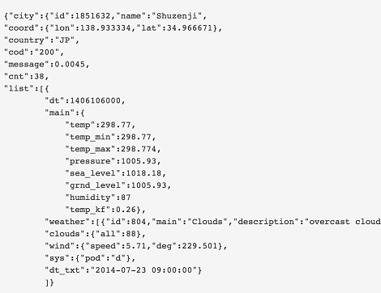

# Chatbot_API_Project
A Project using REST API and Web Requests with an Interfaceable Chat bot.
The Bot is just a simple program conencted to a chatserver, this project uses FreeNode.
	- using the Java.net Library
- The bot can fetch the local weather using the api from open weather map https://openweathermap.org/api
	
	- you can use command phrases such as "weather 'ZIPCODE'" 
	- shoud return “The weather’s going to be X with a high of Y and a low of Z.”
